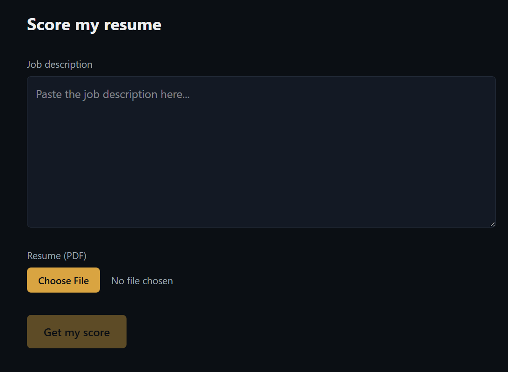
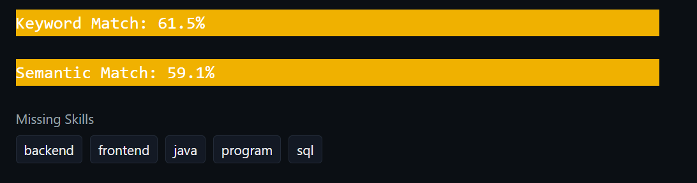

# Resume Intelligence Platform

A full-stack NLP application that scores resumes against job descriptions using both keyword matching (TF-IDF) and semantic similarity (embeddings) — built to solve the real problem of "does my resume actually match this JD?" with a real scoring pipeline, not a GPT wrapper.

🔗 **Live demo:** https://resume-intelligence-frontend.onrender.com/


---

## What it does

Upload a resume (PDF) and paste a job description. The platform returns:

- **Keyword match score** — TF-IDF-based comparison via scikit-learn
- **Semantic match score** — embedding-based cosine similarity, capturing conceptual overlap that keyword matching misses (e.g. "led a team" vs. "managed engineers")
- **Missing skills** — keywords present in the JD but absent from the resume
- **Aggregate analytics** — most commonly missing skills and score trends across all submissions

## Why it's not just an API wrapper

The engineering lives in the scoring system itself:

- TF-IDF vectorization built and understood from the ground up before reaching for scikit-learn
- Semantic similarity via local embedding inference (no third-party LLM call per request)
- A real, growing dataset of anonymized submissions powering the analytics layer

## Tech stack

**Backend**
- FastAPI
- PostgreSQL + SQLAlchemy
- scikit-learn (TF-IDF, English stop words filtered)
- `fastembed` (ONNX runtime) running `BAAI/bge-small-en-v1.5` for semantic embeddings
- `pdfminer.six` for PDF text extraction
- `python-dotenv`

**Frontend**
- React + Vite
- Tailwind CSS v4 (`@tailwindcss/vite`)
- `react-router-dom`
- Chart.js

**Infrastructure**
- Docker + Docker Compose (local dev)
- Deployed on Render (free tier)

## Architecture

```
┌─────────────┐      ┌──────────────┐      ┌──────────────┐
│   React UI   │ ───► │   FastAPI    │ ───► │  PostgreSQL  │
│ (resume+JD)  │ ◄─── │  scoring API │ ◄─── │ (submissions)│
└─────────────┘      └──────┬───────┘      └──────────────┘
                             │
                    ┌────────┴────────┐
                    │  TF-IDF scorer   │
                    │  fastembed (ONNX)│
                    └─────────────────┘
```

## Key engineering decisions

- **Render's free tier caps memory at 512MB.** `sentence-transformers` + PyTorch blew past that on cold load. Swapped to `fastembed`, which runs the same embedding model (`BAAI/bge-small-en-v1.5`) through ONNX runtime instead — same semantic quality, a fraction of the memory footprint.
- Every submission is stored anonymized, which is what powers the `/analytics` endpoint — aggregate "most commonly missing skills" data across real users rather than a single scoring session.

## API endpoints (selected)

| Endpoint | Method | Description |
|---|---|---|
| `/score` | POST | Accepts resume + JD, returns keyword score, semantic score, missing skills |
| `/analytics` | GET | Returns top missing skills and score trend over time |

Full interactive docs available at `/docs` (Swagger UI).

## Running locally

```bash
git clone [PASTE_REPO_URL_HERE]
cd resume-intelligence-platform
docker-compose up --build
```

Backend: `http://localhost:8000/docs`
Frontend: `http://localhost:5173`

Copy `.env.example` to `.env` and set your local `DATABASE_URL` (pointing at the Compose service name, not `localhost`, if running inside Docker).

## Screenshots





## Roadmap

- **Role classification** — tag extracted skills by category (SWE / data / infra) and surface which category dominates a given JD
- **Embedding cache** — hash identical resume/JD inputs to skip redundant embedding calls, cutting response time on repeat queries under Render's free-tier constraints
- **Certification recommendations** — based on missing skills, suggest 2–3 free certs (e.g. Google IT Support, AWS Cloud Practitioner)
- **User feedback loop** — thumbs up/down on score results, stored and used to sanity-check scoring accuracy over time
- Expanded skill taxonomy as more submission data comes in

## What I learned building this

- Production memory constraints change your architecture decisions — the "right" library on paper (`sentence-transformers`) wasn't viable on a free-tier deploy target, so the real skill was finding an equivalent-quality alternative that fit the constraint
- TF-IDF and embedding similarity answer genuinely different questions ("same words?" vs. "same meaning?"), and surfacing both gives a more honest picture than either alone